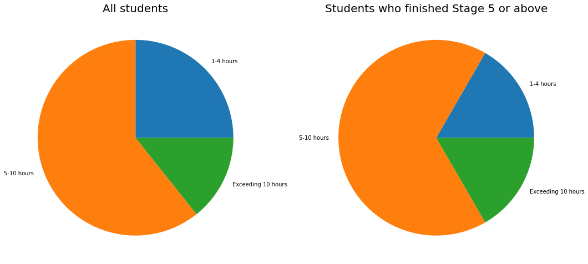
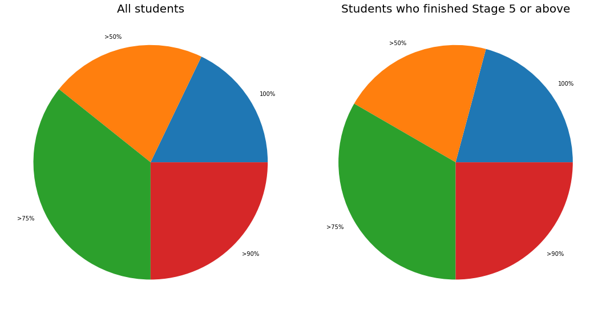
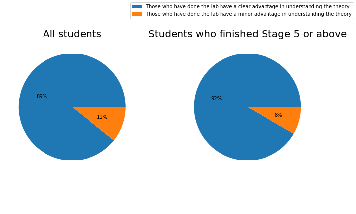

# Winter 2020, B.Tech Semester 6 Compiler Lab, NIT Calicut

**Total number of students crediting the course: 28.**

**Duration of the course: One semester (13 weeks). Credit Units: 3**  
  
A feedback questionnaire was circulated to all the students who credited the course one week before the end of the semester. The responses are summarized below.

**Major stages of the Project** (Each Stage subsumes the previous Stages):

* Stage 4: Imperative programs without functions. Data types: variables and arrays of integer/string type.
* Stage 5: Imperative programs with functions and recursion. Data types: variables and arrays of integer/string types.
* Stage 6: Imperative programs with support for user defined types and dynamic memory allocation.
* Stage 8: Object oriented programming support for classes and single inheritance.

## Q1. _Student Performance_: How many stages of the project did you complete?

{ style="margin:auto;display:block"}

!!! note
    Every student who completed stage 7 also completed stage 8.
  
## Q2. _Time Management_: How many hours of work did you put into the project per week on an average to complete up to what you have done?

{ style="margin:auto;display:block"}

## Q3. _Effectiveness of road map_: What percentage of work could be done without having to refer to material outside the roadmap/documentation of project ?

{ style="margin:auto;display:block"}

## Q4: _Contribution to understanding of theory_: How much did the lab help to improve your understanding of compiler design theory?

{ style="margin:auto;display:block"}

## Q5: _Contribution to Programming skills_: How far did this lab contribute to the improvement of your coding / software development skills?

{ style="margin:auto;display:block"}

## Q6. _Student background_: Was your background sufficient for doing the lab ? If not, in which pre-requisite subjects did you have inadequate prior training.

{ style="margin:auto;display:block"}

## Q7. _Learning experience_: Which stage gave more useful insights?.

{ style="margin:auto;display:block"}

