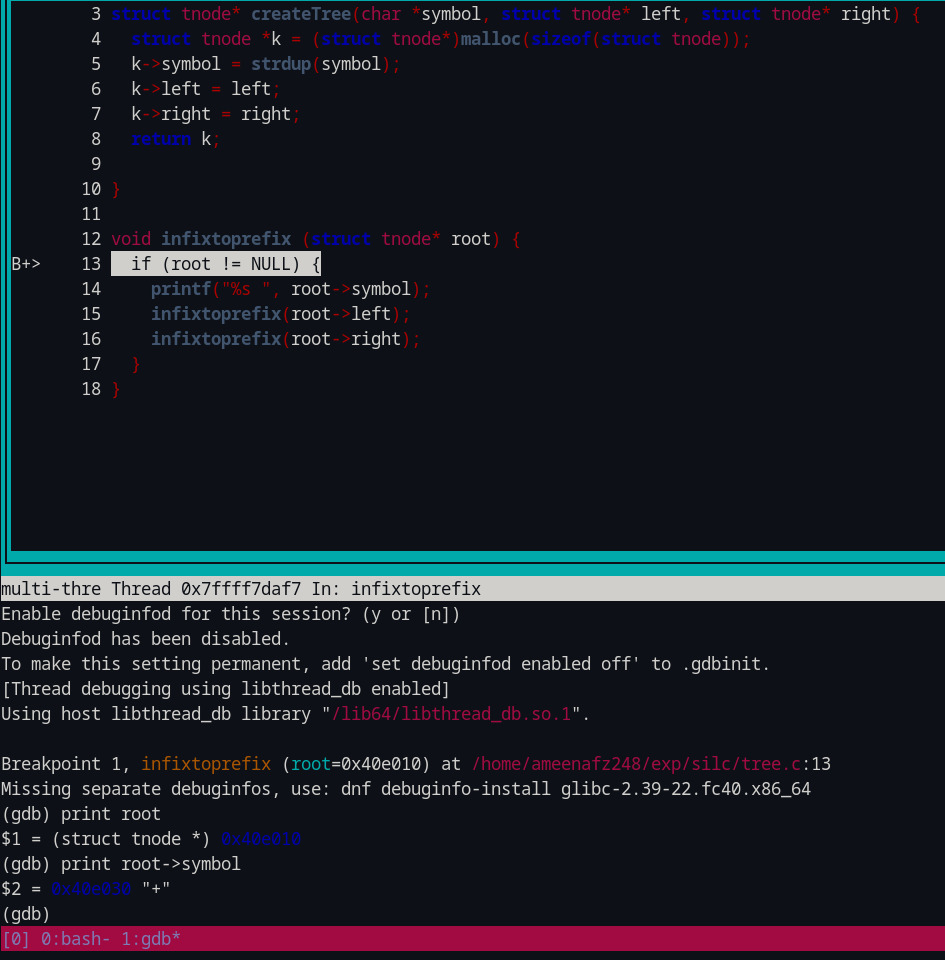

# GNU Debugger (GDB)

## Introduction

A debugger is a program that runs other programs, allowing the user to exercise control over these programs, and to examine variables when problems arise. GDB allows you to run the program up to a certain point, then stop and print out the values of certain variables at that point, or step through the program one line at a time and print out the values of each variable after executing each line.

Errors like segmentation faults may be easier to find with the help of gdb.

GDB allows you to:-

- Pause and continue its execution
- Set "break points" or conditions where the execution pauses so you can look at its state (the value of the variables at that point).
- View and "watch" variable values
- Step through the program line-by-line (or instruction by instruction)

## Installation

Before you install GDB, check whether you have already installed it.

```bash
gdb -help
```

If you have already installed GDB, then it will display all the available options within your GDB,
Else if the terminal says "command not found", then you can proceed with the installation process.

=== "Ubuntu"

    ```bash
    sudo apt-get update
    sudo apt-get install gdb
    ```

=== "Fedora"

    ```bash
    yum install gdb
    ```

Now you can confirm the installation of GDB by executing the command `gdb -help` again.

## Demo

let us demonstrate an use case

let us say we want to convert an infix expression to prefix expression

This is our lex file [lex.l](./gdb-files.md#lexl-file)

This is our yacc file [parser.y](./gdb-files.md#parsery-file)

This is our function to convert an infix expression to prefix expression [infixtoprefix](./gdb-files.md#infixtoprefix-function)

This is our input file [input.txt](./gdb-files.md#infixtoprefix-function)

This is our tree.c file [tree.c](./gdb-files.md#treec-file), this contains the helper functions like the infixtoprefix(), createTree() etc.

This is our tree.h file [tree.h](./gdb-files.md#treeh-file)

**Input :** `abc+(bcd-efg)\*hij`

**Expected Output :** `+ abc \* - bcd efg hij`

We know that we have to construct a infix expression tree by parsing the input string, and then we can do a preorder traversal on that tree to get the prefix. Here, let us see how we can use GDB to verify whether our expression tree / syntax tree is constructed properly.

We know that by manual drawing, the expected expression tree structure is as follows:-


Now let us start our gnu debugger

First we genreate our lexical anaylser from our rules in our lex file [lex.l](./gdb-files.md#lexl-file)

```bash
lex lex.l
```

This generates our lex.yy.c, the lexical analyser file.

Then we generate our parser from our grammar in our yacc file [parser.y](./gdb-files.md#parsery-file)

```bash
yacc -d parser.y
```

This genererates our y.tab.c, the parser file.

To run the program using gdb, we need to compile the lexical analyser and the parser using the `-g` flag of gcc, so that we can see the functions and variables names during the execution of the program in the gdb environment. The `-g` flag preserves the symbol table information generated during compilation of the source program in the target file enabling the debugger to display variable/function names associated with addresses in the program during debugging.

```bash
gcc -g lex.yy.c y.tab.c
```

Now, an executable file a.out would be generated.

Now we can execute the a.out file with passing our input file [input.txt](./gdb-files.md#input-file) to it.

In GDB, we use `--args` flag, if we have to pass any parameters.

```bash
gdb --args a.out input.txt
```

Now our GDB is up.

**layout next** - Opens a Graphical user interface, where you can view the part of the code currently executing along with the code line numbers

`(gdb) layout next`

**break** - You can pass a function name or line number as an argument to this command. It will set a break point corresponding to that line number or function. So that when we run the gdb, it halts at the break point, and then we can move incrementally (step by step) exploring the variables and the execution flow.

Here we can use the break command to halt at the start of the execution of the infixtoprefix function [infixtoprefix](./gdb-files.md#infixtoprefix-function), to examine the working of the function in detail.

`(gdb) break infixtoprefix`

**run** - It runs the program until it encounters one of the break points.

`(gdb) run`

Now, we would have stopped at the start of the execution of the function infixtoprefix [infixtoprefix](./gdb-files.md#infixtoprefix-function)

**next** or **n** - To move to the next line in the local scope, it is basically a step over function, i.e it do not enter any function code.

`(gdb) next`

Now, let us print the symbol stored at the root of the tree, and also view a snapshot of the gdb GUI, after executing the above instructions.

`(gdb) print root->symbol`



**print** - you can use this to print the value of the variables at that point.

In the above image we can see that the command layout next gave us the graphical user interface which allows us to see the code segment currently executing while debugging.

The break statement helped us to reach the interested target function, so that from there we can proceed step by step exploring the contents.

Now let us verify whether we have constructed our expression tree correctly

```
(gdb) print root

$1 = (struct tnode\*) 0x5555555638f0

(gdb) print root->symbol

$2 = 0x55555555afe6 "+"

(gdb) continue
```


root is the pointer to the nodes in the tree, initially root would be pointing at the root of the syntax tree.

When we print out the content in the node, pointed by root, using GDB, we get the output as "+" as expected.

The right side of the image is just to show where the pointer root is pointing at currently in the syntax tree, and we are constructing that tree only from the information that we are gettig through print statements in our gdb.

As the root node is perfect, we are safe to proceed in checking the values of the remaining nodes.

---

**continue** - To run until you encounter next breakpoint

Since the infixtoprefix function is a pre-order traversal of the tree, the function would be recursively called again with the left child of the root node.

Since, we have executed the "continue" statement, the gdb will be executing the code, and halt again only when it reaches the start of the function again, this time due to the recursive call with the left child of root node. This is because we have set a break point at the start of the infixtoprefix function.

```
(gdb) next

(gdb) print root

$1 = (struct tnode\*) 0x555555563710

(gdb) print root->symbol

$2 = 0x55555555636f0 "abc"

(gdb) continue
```


"next" command is used to enter inside the function

Now, same as before we print out the content of the current node, and then we execute the "continue" statement to reach the next node.

Here we found "abc" to the left of "+" node as expected

---

Moving on to the left node of the current node

```
(gdb) next

(gdb) print root

$1 = (struct tnode\*) 0x0

(gdb) continue
```


We habe reached Null node represented by 0x0 in hexadecimal

---

Now we move to the right node, following the pre-order

```
(gdb) next

(gdb) print root

$1 = (struct tnode\*) 0x0

(gdb) continue
```


This helps us to infer that "abc" node is a leaf node

---

Continuing the preorder traversal

```
(gdb) next

(gdb) print root

$1 = (struct tnode\*) 0x555555563711

(gdb) print root->symbol

$2 = 0x55555555636f0 "\*"

(gdb) continue
```


As expected we found "\*" to the right of "+" node

---

```
(gdb) next

(gdb) print root

$1 = (struct tnode\*) 0x555555563720

(gdb) print root->symbol

$2 = 0x55555555636f1 "-"

(gdb) continue
```


As expected we found "-" to the left of "+" node

---

Continuing the same steps, we will find node "bcd" to the left of "-" node, and as expected it turns out to be a leaf node

When we move right from the current node "-"

```
(gdb) next

(gdb) print root

$1 = (struct tnode\*) 0x55555556371b

(gdb) print root->symbol

$2 = 0x55555555636f6 "efg"

(gdb) continue
```


As expected we found "efg" to the right of "-" node

---

Further continuing the debugging, we will discover node "efg" to be a leaf node

Now, when we move right from node "\*"

```
(gdb) next

(gdb) print root

$1 = (struct tnode\*) 0x5555555637c0

(gdb) print root->symbol

$2 = 0x55555555636c2 "hij"

(gdb) continue
```


As expected we found "hij" to the right of "\*" node

---

Further continuing the debugging, we will find Null node to the left of "hij" node

Now, when we move right from node "hij"

```
(gdb) next

(gdb) print root

$1 = (struct tnode\*) 0x0

(gdb) continue
```


Now the program exits, as we have traversed every node of the expression tree via GDB, and verified the contents of all the nodes, and the expression tree is just as expected.

An alternate way is to set a watchpoint

**watch** - You can use a watchpoint to stop execution whenever the value of an expression changes, without having to predict a particular place where this may happen.

`(gdb) watch root`

GDB will monitor the value of the root pointer, and whenever the value of the variable "root" changes (when root points to a different node), gdb halts the execution, and prints the old value and the new value of the "root" variable.

## Infinte Loop

One of the important use cases of GDB start when we encounter a segmentation fault or infinte loop, and trust me, we encounter such errors more often than we thin in the upcoming stages, as the syntax tree becomes more and more complex, during those times, GDB debugging of the syntax tree to verify the contents and to find out went wrong is very helpful and saves a lot of time.

In this example, we can see an infinite loop, for the problem infix to prefix problem. let us see how we can use GDB to find the error in the construction of the express tree / syntax tree.


---

let us print the contents of the tree

```
(gdb) print root->right->symbol

$3 = 0x55555555637f7 "\*"

(gdb) print root->right->left->symbol

$4 = 0x55555555631f1 "-"

(gdb) print root->right->left->left->symbol

$5 = 0x55555555635f2 "bcd"

(gdb) print root->right->left->right->symbol

$6 = 0x55555555631f9 "efg"

(gdb) print root->right->right->symbol

$7 = 0x55555555636f0 "hij"

(gdb) print root->right->right->left

$8 = (struct tnode\*) 0x0
```


---

Everything seems fine so far, let us now verify the contents to the right of node "hij".

```
(gdb) print root->right->right->right

$1 = (struct tnode\*) 0x5555555637f0

(gdb) print root->right->symbol

$2 = 0x55555555637f7 "\*"
```

Now, we are not sure whether this node "\*" is a new node to the right of node "hij" **OR** it is the same node which is a right of node "+", and node "hij" is making a cyclic loop with this node.

  

---

Next, we check whether they are different nodes as shown in the image in the left or it is the same node as in the image shown in the right.

```
(gdb) print root->right == root->right->right->right

$11 = 1
```

Now, we do find that both the node "\*" is actually the same node, and this cyclic loop was actually the cause of our infinite loop. These checkings could be done in minutes to find the source of the error and thus saving a lot of time for you.

Now, we will remove the loop, and check whether our program runs smoothly now.

```
(gdb) set root->right->right->right = 0x0

(gdb) clear infixtoprefix

(gdb) continue

Deleted breakpoint 1 continuing.

Inferior 1 (process 10496) exited normally\]
```

Now, we have removed the cyclic loop, and set the right child of node "hij" as NULL, as it was supposed to be. Then when we resume our program, we can see that **"(process 10496) exited normally"**, which confirms the fact that our program does not have an additional errors, and the only error was the cyclic loop, and we need to remove it.

**set var** - This command is used to modify the current value of a varible, and to see it's effect. An example would be "set var my_sum_var=100"

In the above image, we can see that, we have used the "set" command to change the value of the pointer root->right->right->right to NULL, this actually helped us to check whether this modification helps in solving our infinite loop problem, which it does in this case.

GDB, thus, helps us to save a lot of time in debugging.

## Some of the important GDB commands are :-

- **layout next** - Opens a Graphical user interface, where you can view the part of the code currently executing along with the code line numbers
- **start** - It starts debugging from top, and gives control to user
- **break** - You can pass a function name or line number as an argument to this command. It will set a break point corresponding to that line number or function. So that when we run the gdb, it halts at the break point, and then we can move incrementally (step by step) exploring the variables and the execution flow.
- **continue** - To run until you encounter next breakpoint
- **run** - It runs the program until it encounters one of the break points.
- **next** or **n** - To move to the next line in the immediate scope, it is basically a step over function, i.e it do not enter any function code.
- **step** or **s** - To step into the function, so that we can look into the details of the currently executing function
- **print** - you can use this to print the value of the variables at that point.
- **set var** - This command is used to modify the current value of a varible, and to see it's effect. An example would be "set var my_sum_var=100"
- **quit** - To stop the debugging process
- **refresh** - To restart the debugging process from the top.
- **clear** - This command is used to clear the set breakpoints, an example could be "clear my_func"
- **backtrace full** - This is a useful command when you encounter a segmentation fault. A backtrace is a summary of how your program got where it is. It shows one line per frame, for many frames, starting with the currently executing frame (frame zero), followed by its caller (frame one), and on up the stack.
- **watch** - You can use a watchpoint to stop execution whenever the value of an expression changes, without having to predict a particular place where this may happen.
- **rwatch** - Set a watchpoint that will break when the value of expr is read by the program.
- **awatch** - Set a watchpoint that will break when expr is either read from or written into by the program.
- **info watch** - This command prints a list of watch points
- **info break** - This command prints a list of break points
- **list** - Lists the source code (10 lines around the PC)
- **dele {val}** To delete the set watch points or break points.
- **x {var_name}** - It shows the memory location where this variable is stored and the value stored in that address, both in hexadecimal.
- **quit** - To stop the debugging process

#### Some important commands in detail:-

- **Run**

  `(gdb) run`

  If it has no serious problems (i.e. the normal program didn’t get a segmentation fault, etc.), the program should run fine here too.
  If the program did have issues, then you (should) get some useful information like the line number where it crashed, and parameters to the function that caused the error.

- **Break**

  `(gdb) break my_file_1.c:5`

  This sets a breakpoint at line 5, of my_file_1.c. Now, if the program ever reaches that location when running, the program will pause and prompt you for another command.

  You can set as many breakpoints as you want, and the program should stop execution if it reaches any of them.

  Typing “step” or “next” a lot of times can be tedious. If you just press ENTER, gdb will repeat the same command you just gave it. You can do this a bunch of times.

- **Watch**

  `(gdb) watch my_var`

  Whereas breakpoints interrupt the program at a particular line or function, watchpoints act on variables. They pause the program whenever a watched variable’s value is modified. In the above example, whenever my_var’s value is modified, the program will interrupt and print out the old and new values.

- **Conditional Breakpoints**
  Breakpoints by themselves may seem too tedious. You have to keep stepping, and stepping, and stepping. . .

  Once we develop an idea for what the error could be (like dereferencing a NULL pointer, or going past the bounds of an array), we probably only care if such an event happens; we don’t want to break at each iteration regardless

  So ideally, we’d like to condition on a particular requirement (or set of requirements). Using conditional breakpoints allow us to accomplish this goal. . .

  Just like regular breakpoints, except that you get to specify some criterion that must be met for the breakpoint to trigger. We use the same break command as before:

  `(gdb) break my_file_1.c:5 if i >= SIZE_OF_ARRAY`

  This command sets a breakpoint at line 5 of file my_file_1.c, which triggers only if the variable i is greater than or equal to the size of the array (which probably is bad if line 5 does something like array\[i\]). Conditional breakpoints can most likely avoid all the unnecessary stepping, etc.

- **Pointer Operations**
  See the value (memory address) of the pointer:

  `(gdb) print struct_pointer`

  See a particular field of the struct the pointer is referencing:

  `(gdb) print struct_pointer->name`

  You can also use the dereference (\*) and dot (.) operators in place of the arrow operator (->):

  `(gdb) print \*struct_pointer`

  See the entire contents of the struct the pointer references

  `(gdb) print (\*struct_pointer).name`

  You can also follow pointers iteratively, like in a linked list:

  `(gdb) print list_prt->next->next->next->data`
