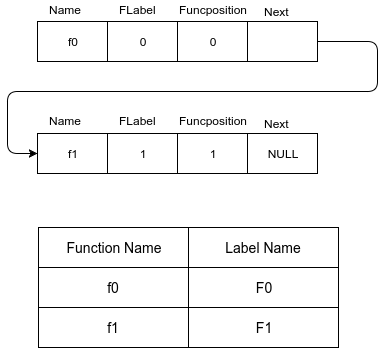
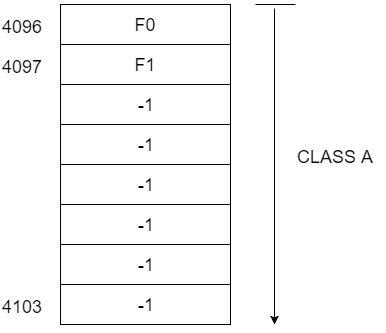
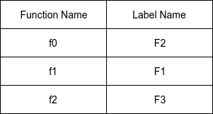
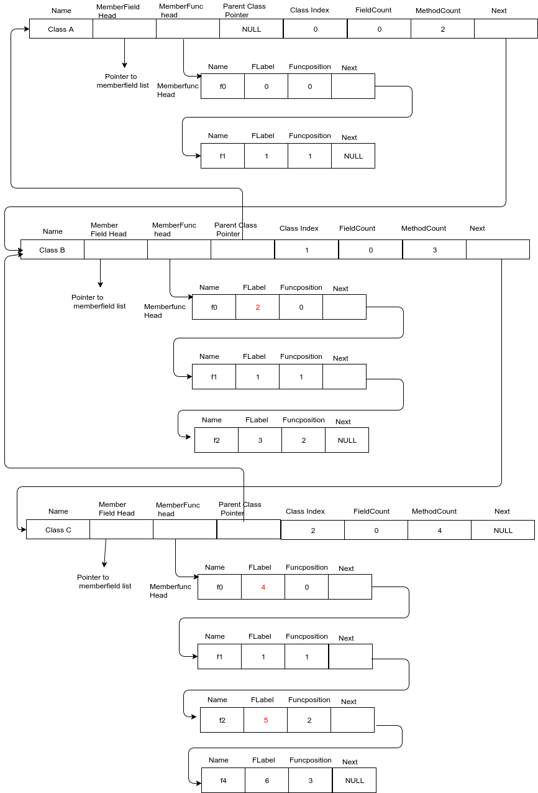
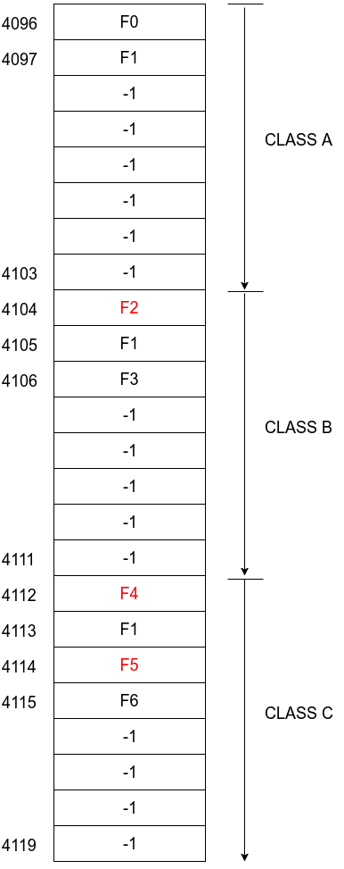
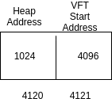
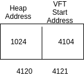
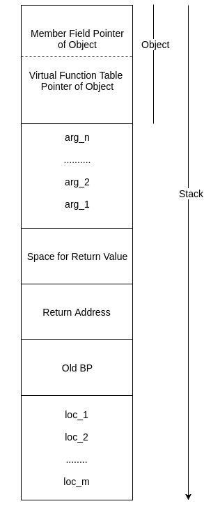
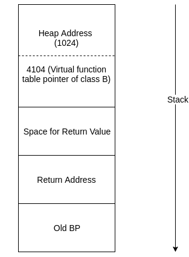

OExpL Runtime Data Structures

* [Home](index.html)
* [About](about.html)
* [Roadmap](roadmap.html)
* [Documentation](documentation.html)

* * *

Runtime Data Structures for OExpL

* [Virtual Function Table](#nav-virtual-function-table)
* [Illustration](#nav-illustration)
* [Run Time Binding](#nav-runtimebinding)
* [Method Invocations](#nav-methodinvocations)
* [Run time Stack Management for Method invocations](#nav-runtimestackmanagementformethodinvocations)

Virtual Function Table
----------------------

**Virtual Function Table** is a run time data structure that is used to resolve at run time the call addresses of methods in a class. Such mechanism (or other table schemes) needs to be implemented by compilers for languages that support [inheritance](https://en.wikipedia.org/wiki/Inheritance_(object-oriented_programming)), [subtype Polymorphism](https://en.wikipedia.org/wiki/Subtyping) and [method over-riding](https://en.wikipedia.org/wiki/Method_overriding). A run time virtual function table is maintained in the memory for each class. **The compiler generates code to initialize the table for each class such that each function that can be invoked from the class has an entry in the table**. For each function defined or inherited by a class, the table will contain the call address of the function in the code region of memory. **If a function is inherited by a class from its parent and is not over-ridden by the class, the call address stored will be that of the function defined in the parent class**. The same address will be stored for the function in the virtual function table of the parent class as well.

The OExpL compiler maintains a virtual function table of eight words for each class. Hence, a class can have at most eight member functions. The i-th entry in the table holds the address of the i-th function of the class (identified by the field **Funcposition** in the [class table](http://silcnitc.github.io/oexpl-data-structures.html) - see Memberfunclist). While generating code, **if there is a call to a function within a class, the compiler simply translates the call to "CALL \[address\]", where address is obtained from the corresponding virtual function table**.

A simple way to place the virtual function table is to use the initial part of the stack region (starting at memory address 4096), ahead of global variables. This is suggested because the compilation of classes will be finished before compiling the global declarations. In this scheme, the virtual function table of the class defined first in the program will be stored in the region 4096-4103, the second in 4104-4111 and so on.

When the compiler encounters the declaration of a variable of a class, it allocates **two words of storage** for the variable (unlike other variables, where only one word of storage is allocated). The first word is used to store the address of the memory area allocated in the heap for the class (eight words). Space for member fields is allocated in the heap exactly as done with user defined types. We will call this word the **member field pointer**. **The second word is used to store the address of virtual function table**. We will call this word the **virtual function table pointer**.

**The key point to note here is that the virtual function pointer of a variable need not always point to the virtual function table of the class of the variable. This is because a variable of a parent class can hold a reference to an object of any of its descendant classes. In such cases, the virtual function pointer will hold the address of the descendant class.**

Hence, an assignment of a variable (of one class) to another variable (of the same class or an ancestor class) results in transfer of the contents of both the pointers of one variable to the corresponding pointers of the other. The _new_ function sets the virtual function table pointer to the address of the virtual function table of the class specified as the argument to the new function. A little bit of thought is necessary to reveal that this implementation will yield the correct execution semantics.

A detailed illustration follows.

Illustration
------------

1. Storage for virtual function tables start at 4096 in the stack. Eight consecutive words are allocated for storing the virtual function table of each class. Each word of virtual function table stores the call address of the corresponding function in the class. Thus, a class can contain atmost eight methods. Virtual function tables of various classes are stored in the order in which the classes are declared in the program. As noted earlier, we will allocate the space for global declarations after virtual function tables are allocated.

    By using the _Class\_index_ field of the [class\_table](http://silcnitc.github.io/oexpl-data-structures.html) entry, the starting address of the virtual function table for that particular class can be computed using the formula **4096 + (Class\_index \* 8)**. The class defined first will have _Class\_index_ zero, the next will have one and so on.

3. **When the declaration of each method is found (in a class) a new label is generated for the function and the label is stored in the [class table entry](http://silcnitc.github.io/oexpl-data-structures.html)** (See _Memberfunclist_ ) **for the function at compile time.** The compiler also must generate code to store these labels into the virtual function table entry of the function in the corresponding class. (Strictly speaking, an integer value called the "pseudo-address" for the function is stored in the _flabel_ field of the _Memberfunclist_ entry of the function. The pseudo addresses could be 0,1,2,3 and so on. When code is generated, for functions with _flabel_ values 0,1,2,3, etc., the actual labels placed could be F0,F1,F2,F3 etc to make them more human readable.)

5. **It is better to maintain the index of a method in the [class table](http://silcnitc.github.io/oexpl-data-structures.html) (Funcposition) and the virtual function table to be the same.** This makes code generation for method invocations easier. When a method is invoked, the compiler can look up the index of the method from the appropriate class table and generate code to invoke the function whose call address (label) is stored in the virtual function table at the position determined by index.

\[Note 1: that the class table is a static (compile time) data structure and will not be part of the target program. The compiler uses the class table information to generate code that will create the virtual function table at execution (run) time.\]

\[Note 2: It is sufficient to place labels, and not addresses in the virtual function table, as the [label translation phase](http://silcnitc.github.io/label-translation.html) will take care of translating labels to addresses\].

In the example given, the function f0 in class A has funcposition 0 and say flabel F0 (we identify flabel 0 with F0) and the function f1 in class A gets a funcposition 1 and say flabel F1 (we identify flabel 1 with F1). The member function list of class A looks as shown in the below figure :  
  
The virtual function table of class A looks as shown in the figure below. It is constructed using member function list of class A which is shown in the figure above.  
  
As mentioned earlier, all the labels of the functions will be replaced with addresses during [label translation phase](http://silcnitc.github.io/label-translation.html).

11. Class B extends class A and over-rides f0(). Further, class B contains the newly defined method f2(). When a class extends another, all the member fields and methods of the parent class are inherited by the derived class, unless over-ridden by a new definition. Since the method f0() is over-ridden by B, a new label will have to be allocated for the function f0() in class B. In the present example, we set the new label to F2. Accordingly, the compiler must update _Memberfunclist_ entry of the method f0() in class B with the new _flabel_ value. Correspondingly, in the virtual function table entry for class B, the entry for method f0() must be F2 (over-riding F0). The entry for method f1() (label F1) will be inherited from class A. A new label (label F3 in the example) must be generated for the function f2() defined in class B. The labels for each method in class B is shown in the table below for easy reference.  

      
    
    From an implementation point of view, it will be easier to (generate code to) copy all the virtual function table entries of A to the virtual function table of B and then (generate code to) modify the labels of over-ridden functions/add labels for new functions defined in B. The compilation for class C may proceed similarly. Note that OExpL specification stipulates that the signatures of the over-ridden methods must match exactly with the signature of the original definition in the parent class.
    
      
      
      
      
    
    ★ Overridden labels are marked in red
    
    The corresponding virtual function tables of all the classes are shown in the figure given below :
    
      
      
      
    
    ★ Overridden labels are marked in red

Runtime Binding
---------------

Please go through the [OExpL Specification - Run time Binding](http://silcnitc.github.io/oexpl-specification.html#nav-run-time-binding) carefully before proceeding further.

Consider the OExpL code given below assuming the classes defined [above](http://silcnitc.github.io/oexpl-run-data-structures.html#nav-illustration)

The method invocation within the statement obj.f0() in the above code needs to be analysed carefully. Depending on the run time value of n, the actual function to be invoked will be different. **This is because the variable obj will be bound to different classes depending on the value of n**. Here we describe what the compiler must do to bind obj to the correct class at run time.

We have already noted earlier that, when the compiler encounters the declaration of a variable of a class, it has to allocate **two words of storage** for the variable (unlike other variables, where only one word of storage is allocated). The first word ( **member field pointer** ) is to store the address of the memory area allocated in the heap for the class (eight words). The compiler must use the second word ( **virtual function table pointer** ) to store the address of the virtual function table of the class to which the variable is bound to at run time.

For instance, the statement _obj = new(A);_ must result in two actions:

1. The member field pointer of _obj_ must be set to a newly allocated heap block.
2. The virtual function table pointer of _obj_ must be set to the start address of the virtual function table of class A.

Recall that the start address of the virtual function table for a class can be computed as (4096 + _class\_index_ \* 8). In the above example, since the _class\_index_ of class A is zero, the above statement sets the virtual function table pointer value of obj to the value 4096.

Similarly the statement obj=new(B) results in the compiler generating code to store the value 4104 to the virtual function table pointer of the variable obj. obj=new(C) would result in storing the value 4112 to the virtual function table pointer of obj. As an illustration, assume that the compiler has allocated memory address 4120 and 4121 for storing the member field pointer and virtual function table pointer of obj. Assume that a call to the new function results in allocation of 8 words in the heap starting with the memory address 1024 (using the [Alloc()](http://silcnitc.github.io/run_data_structures/heap.html) library function). The following figure shows how the values of memory locations 4120 and 4121 has to be set for various values of n.  
  
if '( n < 0)' then the two words of obj is :  
  
  
  
if '(n = 0)' then the two words of obj is :  
  
  
  
if '(n > 0)' then the two words of obj is :  
  
  
  
In the above code, the value of n is read from the console and is not known at the compile time. Hence, the actual value stored in the virtual function table pointer of obj during run-time cannot be predicted at compile time. Consequently, the actual function invoked by the call obj.f0() cannot be predicted at compile time. This fact forces the compiler to generate code to maintain the virtual function tables at run time.

**Note that an assignment statement would result in copying the values of both the pointers of the variable on the right side to the variable on the left side.**

Method Invocations
------------------

Consider the statement **write(obj.f0());** in the above code. The compiler can resolve the call _obj.f0();_ by generating code to:

1. Use the virtual function table pointer field of _obj_ to find the address of the virtual function table of the class to which obj is bound to.
2. Look up the virtual function table to find the address (label) of the function f0().
3. Call the function (of course, after setting up the call stack).

When compiler encounters the method invocation, **obj.f0()**, it first checks the type of _obj_ - i.e, to which class the **obj** belongs to. Then it gets the member function list of the class of that object and checks if there is any method with name **f0**. If it finds a method, it proceeds with the compilation. Otherwise, a compilation error is reported.

In more detail, for the call _obj.f0()_, the compiler must do the following:

1. Find the index of _f0()_ in the [class table](http://silcnitc.github.io/oexpl-data-structures.html) entry of _obj_. Here _obj_ is declared to be of class A and the index (look up Funcposition field in the member function list of class A) of _f0()_ in class A will be 0.
2. Generate the code to push the registers in use into the stack
3. Generate the code to move to a register (say R0) the label of the function at index 0 from the virtual function table of _obj_. The virtual function table pointer field of obj will point to the virtual function table.
4. Generate code to push the "self object" into the stack as argument (i.e., the member field pointer of obj and the virtual function table pointer of obj must be pushed as arguments to the call to f0() - See Run time Stack Management for Method Invocations below .)
5. Generate code to call the function using the label obtained in step 2. (call R0).
6. Generate code to unwind the stack, extract return values upon return from the call and restore registers.

**Note:** The OExpL specification requires that a class can have only a single method of a given name, and the signature of a method inherited from a parent class (over-ridden or otherwise) must be identical with the signature of the method in the parent class. These simplifications allow the above implementation of virtual function tables where, the index of a method in the virtual function tables of every class in a class hierarchy is unique. If method overloading was supported, then there would be multiple functions with the same name within a class, and the implementation would be slightly more involved. (Think what additional stuff needs to be done in that case!)

Run time Stack Management for Method invocations
------------------------------------------------

While generating the code for invoking a method of a class using an object of the class (for example, in the call obj.f0() above, f0() is invoked using the object obj of class A) **the member field pointer and virtual function table pointer of the object must be pushed to the stack in addition to normal arguments of the function.** We will follow the convention that these two values will be pushed before other arguments are pushed. This is how the runtime stack looks, when a method of a class is **called**.  
  
  
For instance, in the above [example](http://silcnitc.github.io/oexpl-run-data-structures.html#nav-runtimebinding), The value of _n_ read from the input is 0, the following figure shows the run time stack. Note that the function f0 has no arguments.  
  
  

##### **Why do we need to push the object? Illustration:**

According to OExpL Specification, a member field or method should be accessed using _self_. In order to correctly specify the object referred to _self_, we need to push the object (member field pointer and virtual function pointer) into the stack.

Consider the following OExpL program,  

##### **Use of self for member field access :**

Consider the statement self.i = 0 or self.i = 1 . We need to store the value 0 or 1 for the member field i, of the object represented by the _self_ (calling object). In order to identify the object's heap address, the **member field pointer** of the _obj_ must be available as an argument in the stack.

##### **Use of self for method invocations :**

Suppose n > 0, then the variable _obj_ will be bound to an object of class A. If n <= 0, then the variable _obj_ will be bound to an object of class B.

When the compiler encounters the method invocation _obj.f0()_, the virtual function table of _obj_ will be looked up to find the call address of the method f0(). Since f0() is defined in class A and not over-ridden by class B, the virtual function tables of both class A and class B will store the same call address for f0().

However, inside the method f0(), there is a call to the method _self.f1()_. Note that f1() is over-ridden by class B. Hence, the **call address for the method f1() when _obj_ holds an object of class A will be different from the call address of f1() when _obj_ holds an object of class B. However, the class corresponding to the object stored in _obj_ is determined by the value of n which is not known at compile time.** Hence, to generate code for the call _obj.f1()_ inside f0(), the virtual function table of the class to which _self_ is associated must be available as an argument in the stack. Inside f0(), when the compiler translates the call _self.f1()_, it needs to do the following:

1. Generate code to look up the **virtual function table field** of _self_ (received as argument) to find the call address of the function f1().
2. Generate code to invoke f1() using the address obtained (of course, after setting up the call stack).

* [Github](http://github.com/silcnitc)
* 

Contributed By : [J.Ritesh](#)  
        [J.Phani Koushik](#)  
        [M.Jaya Prakash](#)

* [Home](index.html)
* [About](about.html)

window.jQuery || document.write('<script src="js/jquery-1.7.2.min.js"><\\/script>')
